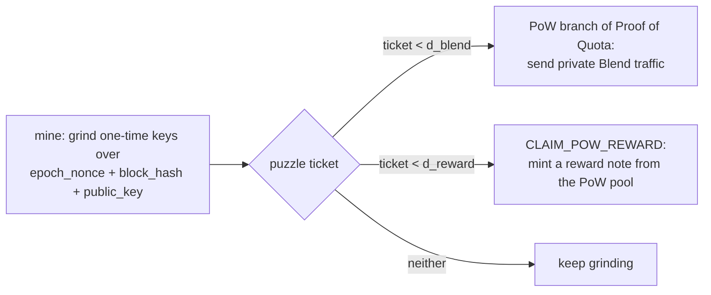
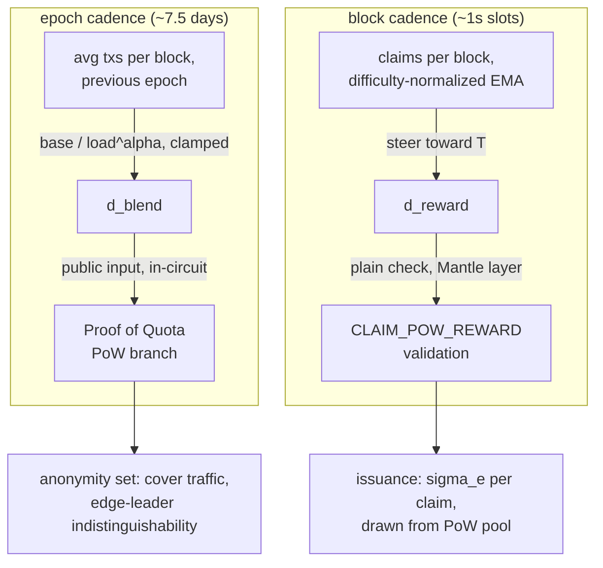

# One Puzzle, Two Dials: How EmPoWering Lets Logos Tune Its Own Security

*Draft of a technical blog post. Based on the EmPoWering proposal (public). Status: First Draft. Figures generated from simulations with illustrative parameters; see Methodology.*

---

Logos has a chicken-and-egg problem that most privacy chains politely ignore. The network is designed to protect you from your first interaction with it. But meaningful participation requires stake, acquiring stake means buying tokens, and buying tokens leaves a public, linkable trail before the privacy system ever gets a chance to do its job. You have to deanonymize yourself to buy your way into the anonymity machine.

It gets worse at the network layer. [Cryptarchia](https://docs.logos.co/blockchain/concepts/about-cryptarchia), the Private Proof of Stake consensus protocol, hides who won the leadership election. The [Blend Network](https://docs.logos.co/blockchain/concepts/about-the-blend-network) hides the link between a proposer and their block by routing proposals through layered encryption, random delays, and cover traffic. Cool. But today, every message an edge node (a newcomer with little or no stake) sends to a core node must be a block proposal, because that's the only payload Blend carries from them. An observer doesn't need to break any cryptography: if an edge node is sending Blend traffic at all, it's leader traffic. That's a censorship target and a hole in the anonymity set, for everyone.

EmPoWering is a proposal to fix both problems with the oldest trick in the book: proof of work. A newcomer runs a miner, earns private access to Blend, earns their first tokens, and transacts, all without touching an exchange or revealing an identity. The part I want to dig into here is not the on-ramp itself but the control system behind it. EmPoWering uses a single PoW puzzle judged against two independent difficulty thresholds, each driven by its own feedback loop. Together with Cryptarchia's epoch structure, they form a mechanism by which the network continuously re-tunes its own security posture: how much cover traffic it admits, how fast it issues tokens, and how expensive it is to attack either dial.

## One ticket, two gates

The miner's job is the same regardless of what they want. Take the current epoch nonce (a per-epoch random value published by consensus, so nothing can be pre-mined across epochs), a recent block hash, and a fresh one-time public key, and grind keys until the puzzle output (the "ticket") lands below the threshold you're targeting.



Two thresholds, two questions:

The **Blend threshold** (`d_blend`) asks "may this message join the privacy layer?" Clearing it lets the miner produce the PoW branch of a Proof of Quota, the zero-knowledge credential every Blend message carries. EmPoWering extends the existing two-branch proof (core node, current leader) to a three-branch disjunction, and the proof reveals nothing about which branch was used. From the outside, a mined-in newcomer's message is indistinguishable from a core node's.

The **reward threshold** (`d_reward`) asks "may this miner earn tokens?" Clearing it authorizes a `CLAIM_POW_REWARD` transaction on [Mantle](https://docs.logos.co/blockchain/concepts/about-mantle), which issues a reward note of known value from a dedicated PoW reward pool. Because the value is known up front, the same transaction can spend the note to pay its own fee. A brand-new user with zero balance can transact in their first act on the network.

The thresholds are independent. There's no ordering between them; a single solution might clear both, one, or neither. That independence is the interesting design decision, because each threshold is moved by a different controller, on a different cadence, measuring a different thing.

## Dial one: the Blend threshold tracks transaction load

`d_blend` is recomputed once per Cryptarchia epoch (roughly 7.5 days) from one observed quantity: the average number of transactions per block over the previous epoch. The rule is

```
target = BLEND_DIFFICULTY_BASE / (load ^ alpha)
```

with `alpha` between 0 and 1, and the per-epoch change clamped to a factor `kappa` in either direction.

The control objective is an anonymity-set argument. Blend's privacy comes from crowding: your message hides among look-alike messages. When organic transaction traffic is abundant, the crowd already exists, so the network can afford to be strict about how many PoW-backed newcomers it admits, which keeps puzzle spam out. When traffic is thin, the crowd is the thing you're missing, so the difficulty drops and PoW-backed messages flow in to build it. Mined traffic is functionally cover traffic that someone did work to send, and unlike the protocol's generated cover messages, it carries real transactions from real newcomers.

![[emp-blend-controller.png]]
*Figure 1. Left: steady-state PoW admissions per epoch as load varies, for three response exponents. Right: the resulting anonymity-set proxy (organic + PoW-backed messages). With a sub-linear response, PoW admissions rise as organic traffic thins, putting a floor under the crowd exactly when the network needs one.*

The design choices here all trade responsiveness away for manipulation resistance, deliberately. An adversary who wants to shrink the anonymity set would try to force `d_blend` up by stuffing blocks with transactions. Three properties make that a bad trade:

1. The input is averaged over the whole previous epoch, so moving it means paying fees across every block of an epoch, a sustained recurring cost rather than a one-block spike.
2. The response is sub-linear. At `alpha = 1/2`, quadrupling the transaction load only doubles the difficulty. Each additional attacker-funded transaction buys less anonymity-set damage than the last, so the attack's cost grows faster than its effect.
3. The clamp bounds worst-case movement. Even a flood that saturates the controller moves the threshold by at most a factor of `kappa` per epoch, and honest participants always get a full epoch to react.

![[emp-blend-flood.png]]
*Figure 2. A simulated fee-funded flood: the adversary quadruples transaction load for 15 consecutive epochs. Admissions dip to about half of baseline (sub-linear response at alpha = 1/2), the effect is capped, and it costs the attacker fees in every single block of every epoch. The dent never clears its own cost.*

Why once per epoch rather than per block? Because `d_blend` lives inside the zero-knowledge circuit as a public input. Every PoW-branch proof in an epoch verifies against the same value, which is exactly what keeps the proof from leaking which branch it used, and keeps the circuit's public inputs stable. Recompute it per block and you'd break that uniformity. The epoch cadence isn't a performance compromise; it's what the privacy property requires, and Cryptarchia's epoch structure supplies the clock.

## Dial two: the reward threshold tracks the claim rate

`d_reward` lives on the opposite end of every one of those trade-offs, and that's the point. It's consensus state on the Mantle layer, never touches the circuit, and is retargeted **every block** to steer the number of accepted reward claims toward a target `T` (the proposal's illustrative value is 10 per block). Issuance control wants a fast controller: its input (claims per block) is free to measure, moving it has no privacy downside, and drift means minting tokens off schedule.

Fast retargeting has a subtlety the proposal is careful about. A single block's claim count is a small Poisson-noisy sample, so driving the controller off one block's count makes the difficulty itself jitter, which widens the spread you were trying to control. And Bitcoin-style retargeting (scale by observed/target) is only correct when difficulty was constant over the observation window, which is false here since the difficulty moves every block. The fix is to normalize each block's count by the target that produced it, giving a difficulty-invariant demand estimate, then smooth that with an EMA, the same construction the execution market's base fee uses.

![[emp-reward-retarget.png]]
*Figure 3. A 5x mining-demand shock (a GPU farm shows up at block 600, drains away after 1200). The naive per-block ratio retarget (red) chases single-block noise and jitters an order of magnitude around the ideal line; worse, its realized claim rate (bottom) runs persistently above target, because scaling by 1/observed on a noisy count is biased upward (Jensen's inequality doing quiet damage). The difficulty-normalized EMA (blue) tracks demand smoothly and holds T through both transitions, at the cost of a brief overshoot while the shock propagates through the smoothing window.*

There's a self-correcting property hiding in this controller that I like a lot. A block builder can include its own claims, so what stops builders from farming the reward pool? Nothing, directly. But more self-claiming raises the realized claim rate, which tightens `d_reward`, which raises the marginal work required per claimed reward for everyone, including the self-dealing builder. The proposal accepts this risk and says so, and one of its open analysis items (§2.3) is quantifying that self-claiming is unprofitable at the margin under realistic costs. I'd want to see that quantification before mainnet, and so would the authors; that's why the list exists.

## Why two dials instead of one

The obvious simplification is one threshold, or at least an ordering between them (say, reward implies Blend access). The proposal explicitly rejects both, and the reasoning is the core of the design.

The two thresholds serve different masters. Blend admission is governed by anonymity-set and spam control; token issuance is governed by monetary policy. Their correct values have no reason to agree, and coupling them forces one objective to distort the other. If a mining-demand surge tightened Blend admission (as a shared threshold would), an influx of miners, the exact population you're trying to onboard privately, would shrink the door they're arriving through. If Blend's slow epoch cadence governed issuance, token emission would drift for days between corrections.

The decoupling also lives in *where* each check happens, and that placement is a privacy decision:



`d_reward` never appears among the circuit's public inputs. It's checked in the open, on the Mantle layer, where a per-block float costs nothing. `d_blend` is verified inside the proof, identical for everyone in the epoch, so a passive observer can't infer anything from it. Each dial gets the cadence its job needs because neither is chained to the other's constraints. The miner's experience stays simple: one grind, and you present your ticket at whichever gate it clears.

## The economics dial has a clock too

The reward pool that funds all of this is its own slow feedback loop, running on the same epoch boundaries. A one-time genesis allocation seeds the pool. Each epoch, the pool pays out a fixed per-claim reward `sigma_e`, set as a fraction `rho` of the current pool divided by the target number of claims. Fees collected across the network refill it: block rewards are split three ways (Blend service, consensus leaders, PoW pool), so the pool's inflow tracks real usage. No tokens are minted from thin air, and a safety cutoff rejects claims outright rather than let the pool go negative.

![[emp-pool-dynamics.png]]
*Figure 4. Simulated pool trajectory over 300 epochs with a logistic fee-adoption curve. The genesis endowment pays elevated rewards early, when the network needs members and token markets are thin, then drains toward an equilibrium where refill balances drawdown (pool ≈ refill/rho). The per-claim reward follows: generous during bootstrap, marginal at steady state.*

This gives the bootstrap subsidy a natural expiry without anyone scheduling one. Early on, mining pays well precisely because the pool is large relative to its drain, which attracts participants when nothing else will. As organic fee volume grows, the endowment's share of the payout shrinks and mining settles into a modest, fee-funded on-ramp. PoS participation remains the strongly incentivized path; EmPoWering is the ladder up to it.

## What this buys, and what's still open

Pull the three loops together and you get a network that adjusts its own security posture without governance intervention. Thin traffic? The Blend dial opens, mined cover traffic builds the anonymity set, and edge-node leader traffic disappears into ordinary transaction flow. Heavy traffic? The dial tightens against spam, because the organic crowd is doing the anonymity work. Mining demand spikes? Issuance holds its schedule within a block or two. Adoption grows? The bootstrap subsidy tapers itself. Attack any single dial and you're fighting a controller specifically shaped to make your cost grow faster than your effect.

That's the design intent. Now the honest part: this is a proposal, and the gap between intent and demonstration is exactly the list its own authors put in §2.3. The reward trajectory, pool stability (no oscillation, no deadlock at the safety cutoff), bounds on the stake an adversary can mine during bootstrap, inflation staying inside the protocol's emission envelope, and the difficulty-decoupling claim itself all need analysis before this advances. A couple of items I'd flag on top of that list:

The current puzzle is Poseidon2-based because the Blend branch must be proven inside a SNARK, and Poseidon2 is cheap in-circuit but easy to accelerate on GPUs and FPGAs. For Blend admission alone that might be tolerable (there's no direct economic incentive to farm it), but hardware acceleration cuts against everything the reward path wants from "fair, permissionless" distribution. The authors are considering decoupled puzzle constructions so each side gets optimized for its own domain. Until that lands, "anyone with a laptop mines their way in" is aspirational.

The Blend difficulty is a globally agreed parameter, and a global parameter can't stop an adversary from spamming messages that never land in a block and therefore never move the controller. The proposal acknowledges Blend needs an additional per-node protection layer, dynamically adjustable, and marks it as open investigation. The epoch controller tunes admission policy; DoS protection needs that separate layer.

Neither of these sinks the two-dial architecture, which stands or falls on the decoupling argument, and that argument looks right to me. They do mean the parameter table at the end of the proposal is full of TBDs for a reason.

## Methodology

The figures come from small simulations of the controller equations as specified in the proposal (§4.3 for the Blend controller, §5.6–5.8 for the reward pool and retarget), with illustrative parameters: `alpha = 1/2`, `kappa = 2`, `T = 10` claims per block, EMA smoothing `q = 0.9`, `rho = 1%` per epoch, and a logistic fee-adoption curve for the pool run. Every real parameter is marked TBD in the proposal pending the §2.3 analysis, so treat the figures as qualitative behavior, not calibration. Claim arrivals are Poisson; the flood scenario assumes the adversary can actually sustain 4x organic load in fees for 15 epochs, which at ~7.5 days per epoch is a 16-week commitment. Simulation code is a couple hundred lines of Python; holler if you want it, or if you think a modeling choice smuggles in a conclusion. That second one especially: this piece argues the controllers are well-shaped, and the fastest way to find out I'm wrong is for someone to poke at the shapes.

Thoughts, corrections, and counterexamples welcome. Hit me up, or better, reply where this gets posted.

---

*Roadmap/docs consulted: docs.logos.co pages on Cryptarchia, the Blend Network, and Mantle. Primary source: "EmPoWering the Logos Blockchain" proposal. Strip this note before publishing.*
