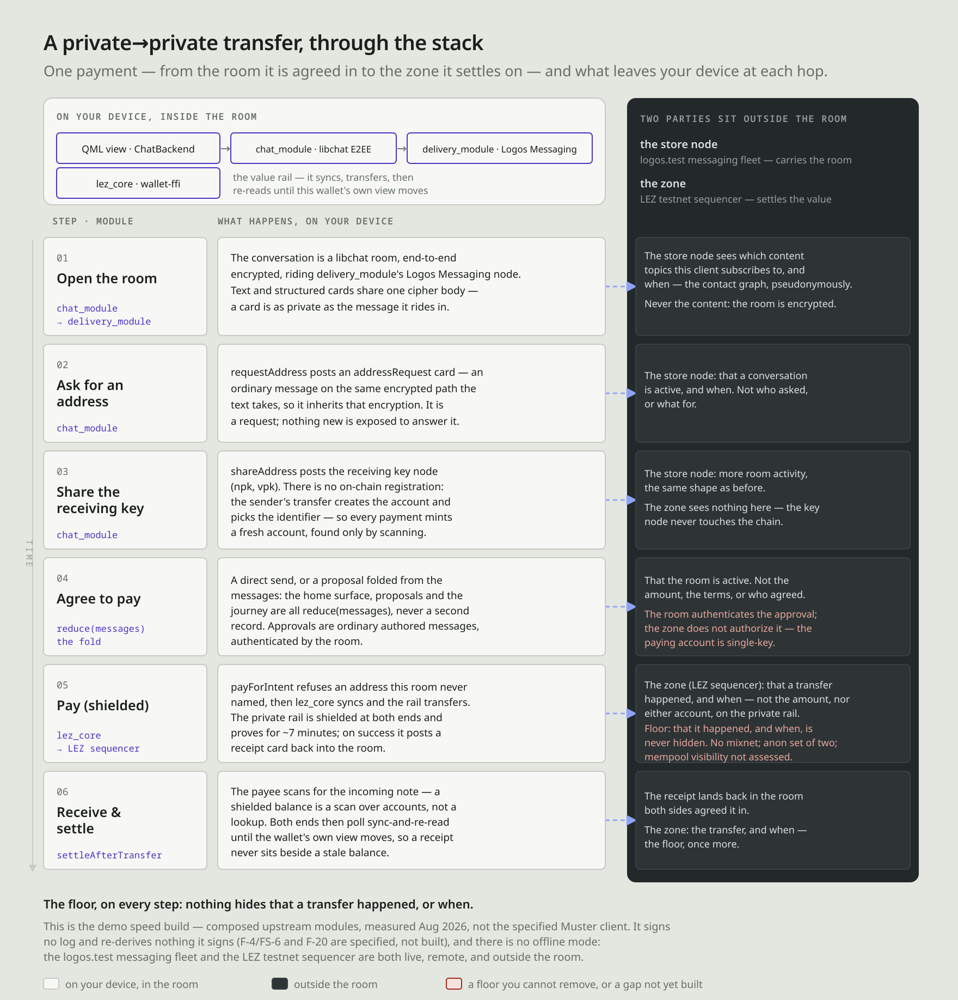

I've spent a good amount of time in "crypto," and I've always been displeased at the incompleteness of everyone's view around privacy and security. When my focus was security, I tried to convey that there's a lot of risk to be concerned about outside of smart contracts, but the industry only really talked or was concerned about them. There's rationality in that somewhat. The blockchain and smart contracts were new and needed tooling and new views at assessing risk within them needed to be developed. That's "where the money is" so to speak to so obvious there's a profitable market there. 

The same concept within privacy seems to be shaping up as it becomes a strong "meta" narrative across the ecosystem. It's always a focus on the blockchain itself and how operations occur above it. But it's so ridiculously incomplete if you take a step back and look at it. What hits the blockchain is actually the end of the entire lifecycle of a transaction. It's the record of so much other work and coordination and all of the steps before have potential to leak so much data that even a private blockchain doesn't actually help. 

This forum post is the start of a series of me investigating this concept, proving out and measuring what gets leaked across the entire txn lifecycle (of various activities) and what consequences that has to the user and the ecosystem at large. 

I've always wanted to do this but never was quite sure how. Fortunately, Logos is at a point where it's so much easier to do this than it's ever been for me. I and AI development drastically leverages how fast I can build things on my own within the Logos ecosystem and what is already out there I can bring in as a module. 

Breaking the txn lifecycle down into 7 stages, we have:

| # | Stage | What happens |
|---|-------|--------------|
| 1 | Discovery | Finding who has what you want |
| 2 | Diligence | Verifying they are who they claim |
| 3 | Negotiation | Agreeing on price and terms |
| 4 | Contracting | Committing in enforceable form |
| 5 | Ordering | Deciding whose trade goes when |
| 6 | Settlement | The only link where value moves |
| 7 | Enforcement | Making the outcome stick |

I personally like thinking about it in a layer of abstraction above that, bucketing some of them together around differentiated activity: 
- coming together with an intended action - discover, diligence, negotiation
- contracting that action into some formality - contracting
- settling and executing that formal contract - ordering, settlement
- reacting to the results of that contract execution - enforcement

Saying it all into a few sentences that reads more smoothly would be: I come together with others with the intention to do something. We agree on what we're doing and create a contract of that agreement. We then register that contract and do the thing. We then we separate and live our lives based on the outcome of that execution. 

Even more succinctly: My friend wanted some SNT, so I sent them some. 

Now think about all the technology we use in order to make those things happen, and how much of that stuff the blockchain _isn't_. Think about who owns that infrastructure and why they own it and how they profit off owning it. Once you've done that for a bit, I think you'll start to realize why everyone who isn't in crypto hates crypto and why we're failing as an industry compared to the ideals we all started out with. Almost all of the failings of crypto happen before anything hits the blockchain. 

INSERT EXAMPLES HERE AND THEIR PLACE IN THE TXN LIFECYCLE

I could literally go on ad nauseum about this (I have for years now). So instead, I'm going to "build an app" (read: vibe code the living shit out of it based on spec-based development practices) to show it, and then write about it in this forum for others to see, challenge, add to, contribute. That app is called "Muster." Why? Because I've always liked the idea of an app that is focused on rallying people together for the purpose of action, so "mustering up" feels like a good way to describe that, and also "Status" is taken already. I also don't want another chat app, but it's crucial to understand that the chat context _can also be the inherited security and privacy context of coordation_.  [I've written about this concept before in the Status forums](https://discuss.status.app/t/what-is-status/4903) and also when "announcing the new Status App" [years ago at EthDenver](https://www.youtube.com/watch?v=5UGqTbqKH90). This is not a new concept for me. You can find the [code in Github](https://github.com/corpetty/muster) and look at all the pretty diagrams that I vibe code along the way at [it's hosted Pages](https://corpetty.github.io/muster). 

Please note, this app is created by me for a number of reasons, the main one being an educational and demonstrative tool to explore what's going on under the hood with our data and how well we can surface it to the user in a meaningful way. Along the way, I'm hoping it makes the decentralized application _I've always wanted_ and is useful to others in getting things done in "web3". Maybe it sucks and just surfaces bugs as I dogfood the Logos tech stack and see how far I can push it and look at its operation. Let's see.  

Why use Logos? Simple. Logos as a technology concept is an attempt to cater to and secure the entire txn lifecycle within the same ecosystem, thus mitigating as much of the issues I've experienced in the industry this whole time. Additionally, it's modular and provides a good development experience which is amenable to vibe coding and at a stage where I can meaningfully build stuff without being on the core dev team. I also am paid to understand things and explain them within Logos and outside of it, and this helps me do that. Also, this is currently built as a standalone application using the Logos stack, but will very soon be offered as a module within basecamp so that you can move more easily between interdependent applications. So [go download Basecamp](https://logos.co/basecamp) and get used to it. Right now, architecturally, it's built this way:

DIAGRAM OF MUSTER'S ARCHITECTURE

So come with me as we look at the first bucket of activity: Coming together with an intended action.

I'm going to demonstrate this with one of the simplest and most common actions in crypto, sending someone some tokens. In Muster, I'll do this via a private-to-private LEZ transfer, but the concepts described through this particular action's txn lifecycle can be extrapolated to all transactions even though details of the pipeline are different. 

Typically for most, this part of the txn lifecycle isn't even thought of as part of the pipeline at all, but in my opinion, it is a vital part of it. The process of finding all the parties involved with the activity you're doing, finding a common place to coordinate, and then negotiating what you're going to do to get into agreement is all of the intent of the transaction. Knowing a group's intent and ensuring it is explicitly agreed to is valuable, both for the parties involved as well as people who may want to profit off of (or censor) such intent happening. 

Because the industry has been so tunnel visioned on only the blockchain part of the pipeline, we've fostered a standard of use that leverages nothing but hosted platforms that feeds off your data for this part, and rarely if at all is the infrastructure being used remotely connected to the rest of the pipeline. What is beautiful about the Logos vision is that it's all the same infrastructure, so you never need to use different applications across the entire process. Let's walk through this process within Muster's initial demo application. 

Now let's see it in action with the built application and talk specifically about how we do it here and how it's normally done. Below you'll see what it looks like when you start the app. For the purposes of expedition, I've alredy clicked and initialized the wallet within the app, which generates a new wallet (if completely new) and then allows you to fund and sheild those funds from the faucet. I'll build out more robust features later so it's a fully featured wallet (or integrate with [guru's wallet module](https://github.com/hackyguru/logos-modules) which this is based off of!)

You'll see the focus is to "start something" because that's what you should be thinking about doing in Muster, actionable things with people. Under the hood, you've already connected to the only things you'll ever connect to for this workflow: 
- The messaging network (via the `delivery_module`) where we run a Logos Messaging node. 
- The execution zone (via `lez_core`), which connects to a central sequencer at https://testnet.lez.logos.co. This part only happened _because I opened the wallet and initialized it_. It won't connect if it doesn't need to. But we need to read the blockchain and this demo doesn't run a full Logos Blockchain node or sequencer. We _could_ though if we wanted some additioal privacy. 

The rest is local and private the machine it's run on (and the people's you talk to). 

Let's click to start something. For the purposes of this demo and post, I want to send some testnet LEZ tokens from one person to another in a privacy preserving way. So I click the button. 

The initial app demo shows me a few simple options because that's all I've built into it so far. I can talk to someone or initiate a token transfer. It's all a chat room, because that's the best way to understand the security and privacy model. 

The first thing I need to do when sending a transaction is understanding who I'm going to be participating with, and getting their relevant information. In this instance, I am running a second client. I copied the recipient's chat address (generated on start for now) and pasted it here, and chose the desired wallet I want to include into this (for later). 

The app then creates a private E2EE room by fetching their key bundle on the Logos Messaging network, sends them a MLS cryptographic invite, and the app (for now) auto-accepts up on reciept on their end. Now we have a private communication channel to continue the rest of the txn pipeline. Because I chose the "Pay someone" option, upon room creation and acceptance from the recipient, the channel automatically sends a request for an address into the channel. We don't need to talk and figure ouw what is needed, the action dictated much of that so we can automate it and remove any ambiguity or miscommunication and all the time lost associated with it. 

This functionality, to the network, _looks identical to regular messages because they are regular messages_. We are using the chatroom as our security and privacy model, and leveraging the encryption schemes and communication channels that come with it. Additionally, MLS allows us to rekey upon adding/leaving members of the room, which keeps history private for newcomers (including the action cards). 

Normally, you're doing this in telegram/signal/discord/sms/matrix/email/whatever, and the security/privacy understanding is completely variable. Additionally, you can't do the actual action where you're having the conversation. We've all experienced this. What _is_ missing from the app right now is the diligence aspect of things. The communication of the recipient's chat address is out of band and thus unauthenticated by Muster. But this is easily fixed and can be included. We tend to trust the account creation or registries of other applications to do this (_e.g._ unique usernames in the centralizd app, ENS registrations, federated username registrations). These, historically, get spoofed or surveilled for activity. 

Ok, we're in the channel now. You'll notice a few things that aren't normal for a chat app. I've made a side panel that describes how the state of the room got to where it is, and what has changed over its lifeetime, and what information has leaked. Because we're doing everything within Logos, we can watch and monitor that in real time, verify all data sources that we use and introduce, and expose anything that _could_ have left the room. 

If I'm going to be committing to some action with other parties, and I value those actions, it's imperative I'm able to actually track what is it I'm doing and committing to and who could possibly know about it. Why? So I can always make the appropriate decision about what I'm doing and the associated potential consequences. 

I've been sure to list what is currently available within the Logos stack, what we have planned that improve the gaps identified, and things that are just out of our control with the technology. For instance, because Logos Mix isn't complete yet, there is a level of visibility on chat communications that will be mitigated when it's implemented end to end. 

The receiver on the other end got an immediate message with a card that asks to share their address. They just need to click the button. Once that happens, it populates a card on my end with relevant information, and all the follow-up actions that are possible. I built in a voting mechanism (only arbitrated by the room, no central authority or blockchain mechanism yet) which could be useful to "negotiate" how much and agree. 

Up to this point, we have traversed the initial group of the txn pipeline for sending someone funds: 
- discovered both their chat and blockchain addresses
- diligence is left out of this one, but ostensibly for this demo, it's done out of band. What important here is that the app is clear about this in how it shows information to you and it can easily be added and improved because we're working completely within a confined ecosystem. 
- negotiation has been undergone on what it is we're doing and for how much. Much of this was able to be automated based on the structure of the app when we created the room based on _an intended action with others_. 

I'll now walk through the rest of the demo and txn pipeline but keep conversation relevant to this initial grouping. Future posts will delve deeper into the rest of the pipeline. 

So we click the "Send" button because we have all the information we need to be able to send them information. 

The app presents the available options and consequences of each option with respect to information disclosure, allowing me to choose what's appropriate for me in this situation. I do the "Private to private" option and select an amount, then click "Send". 

From here, we generate the appropriate zk-proof that sends a shielded txn in the background locally, with a small action dialoge in the bottom. This, currently on my machine, takes about 7 min. This is the cost of privacy in many cases. No additional information leaves this room, and we can track that, but it will take more time to do it. 

Once complete, a new message is sent to the room that shows the associated information of what has happened, and what information has left the room. Additionally, post txn hooks trigger the wallet to re-sync and update balances automatically

More detail of this activities pipeline and what is triggered and the code it touches can be found in [Muster's documentation](https://github.com/corpetty/muster/tree/main/docs/posts/muster-connection-lifecycle.md) for those interested. 

## Extrapolate that to other things
If we take a look at this bundle of activites as "all the stuff you do before building a txn, we can see that a tremendous amount of coordination and activity is done that is almost utterly severed from the technology we use to actually use the blockchain, and it's almost all completely hosted, surveiled, and monetized by central parties. 

If we increase the complexity of the activity to things like dapps (AMMs, DEX, NFTs, Multisigs, etc), then it gets worse. We introduce centralized technology like DNS, the web browser and necessary extensions, hosted webservices, RPC services, transparent blockchain data and associated convenience-based indexing services, etc. All in the name of just figuring out who we're engaging with and what information we need to build a transaction appropriately. And we must trust them all to function properly. 

## Ok, So what? What's new?
Hopefully, your understanding. We walked through the simplest txn there is, albeit in a new privacy preserving manner enabled by the Logos techstack, the token transfer. While the idea is simple: send someone some tokens, we learned there is a lot more that goes into it than people typically consider, and we also learned that there is a tremendous amount of information that can be leaked during that process, which others find incredibly valuable and monetize in some fashion. Much of those decisions and possibilities are because of the chosen tech stack, and you never really had the option to do anything different. 

As the technology hardens, Logos will give you the options to opt out and do what works for you instead of being only subject to infrastructure that makes those decisions for you and profits off of doing so. 

For now, Logos gives us the ability to show you what's going on. Muster is purpose built to do that as best as I know how to and I have LOTS of plans to improve that over time. Both through looking at different tech stacks to do the same activity (looking at you ETH token transfer via Nimbos integration) as well as expanding all the possible things you can do in web3 (looking at you multisig and large file transfer). What's interesting to me about doing this is that the UI never changes. It's always just the same thing: pick an activity and who you want to do it with, open a secure communications room and do it with as much privacy, automation, and precision as possible. 

Because we're buidling with Logos, we can watch what goes in and what out out across the entire txn lifecycle and how information leaks and gets exposed and what we can possibly do about it, and the trade-offs being made when we do various things about it. We (in the planned future) can also look at how we can _verify ever single peice of data that leads to important activities_ and provide the audit log of that data. This means when you're about to sign something or do an important activity, you'll be able to see the exact provenance of everything that contributed to the contract you're about to engage into. To me, that potential is exciting, and what I want when "using web3".

## What's next?
Like I said, I'm going to keep going. I'll continue explaining the nuances and details of the entire transaction pipeline and how information leaks across it traditionally. I'll explain how economies based in surveillance and data aggregation profit off those leaks. I'll explain how Logos is attempting to shore up those leaks with the tech stack being built, and I'll keep trying to make that easy and convenient to understand by expanding Muster's capabilities and UX. 

Join me: 
- Download Basecamp: https://logos.co/basecamp
- Play with Muster: https://github.com/corpetty/muster
- Engage with this post. Ask questions, tell me how I could do something better, tell me what I got wrong, tell me what you want to see next. Do something.
