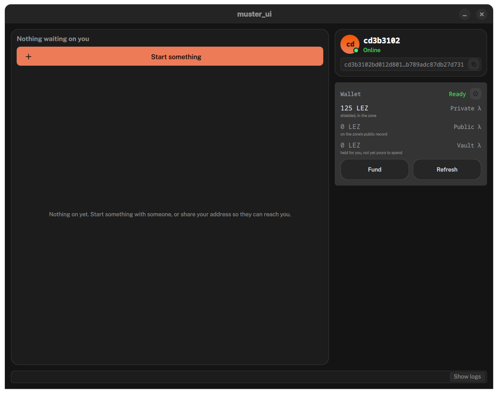
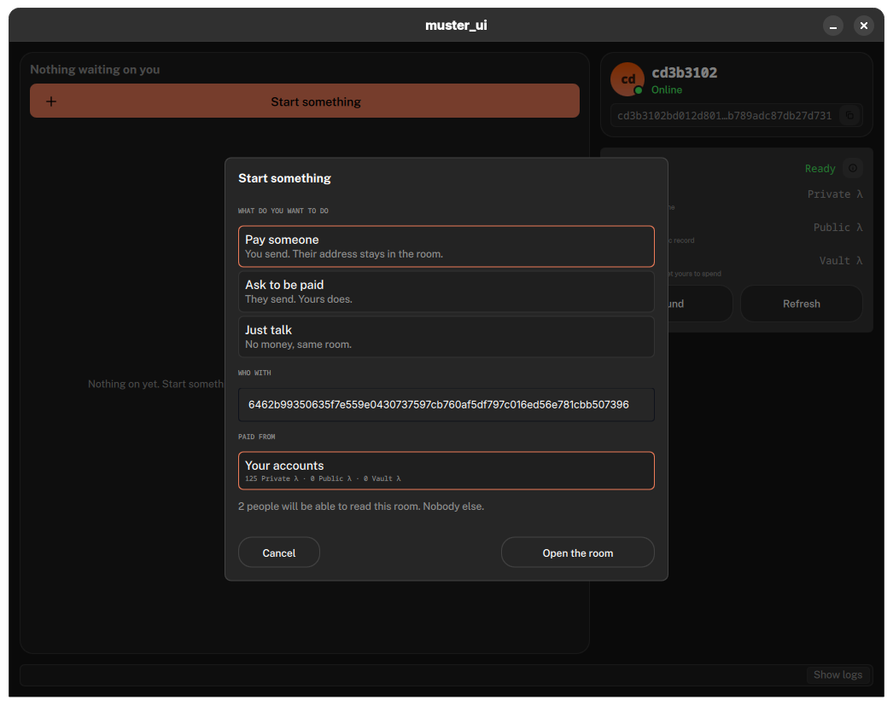
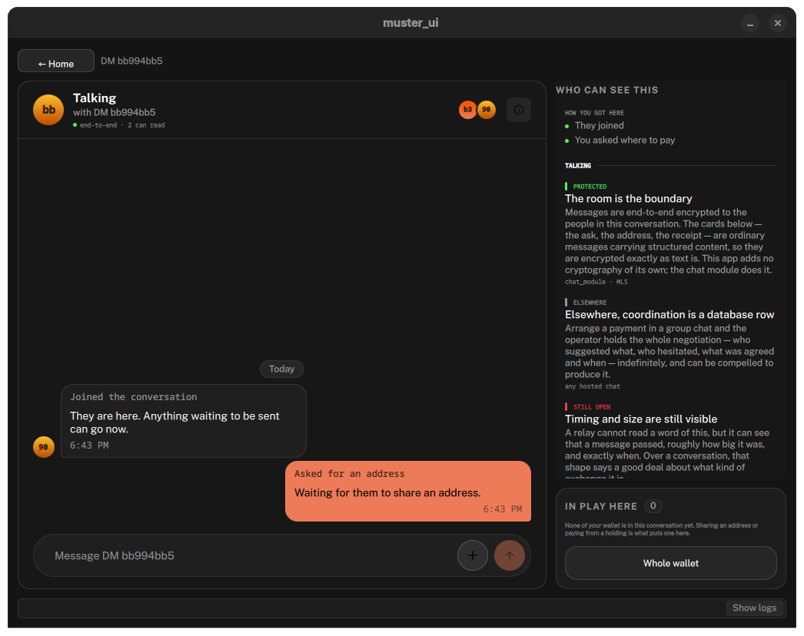
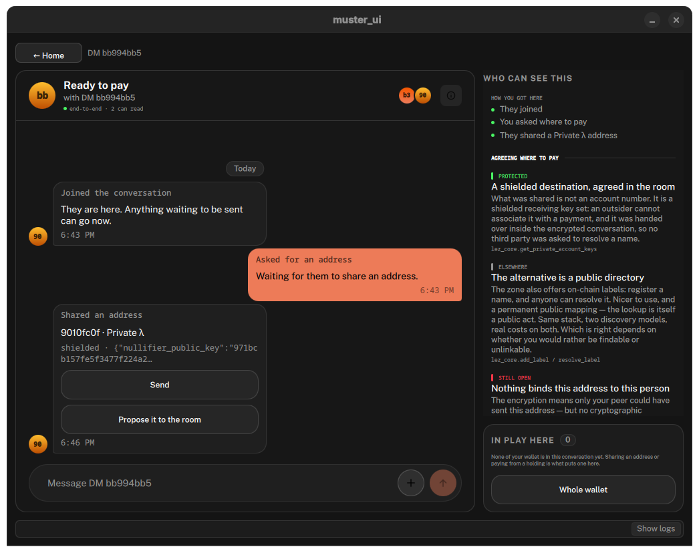
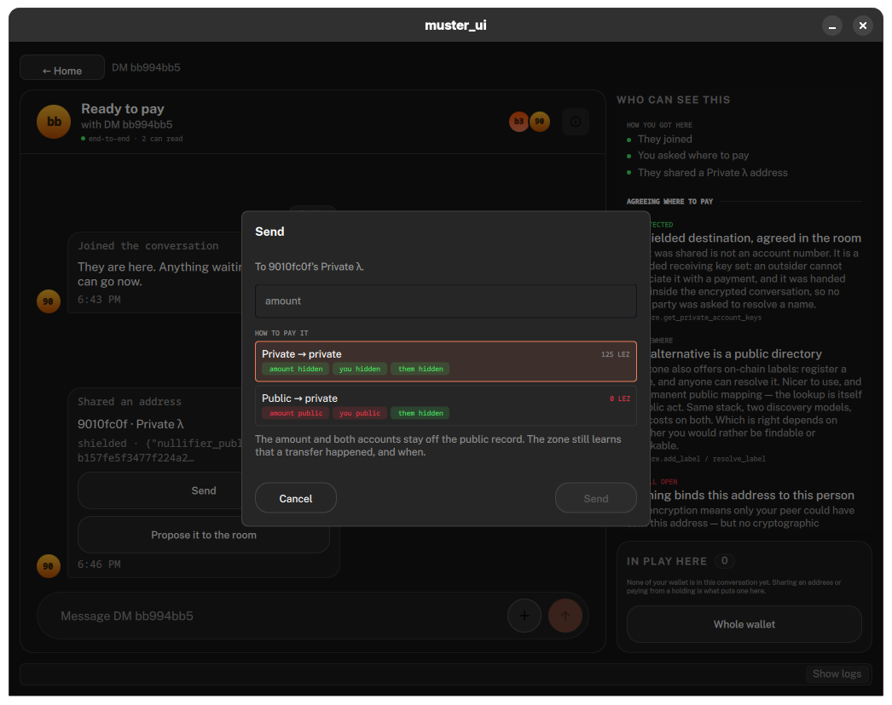
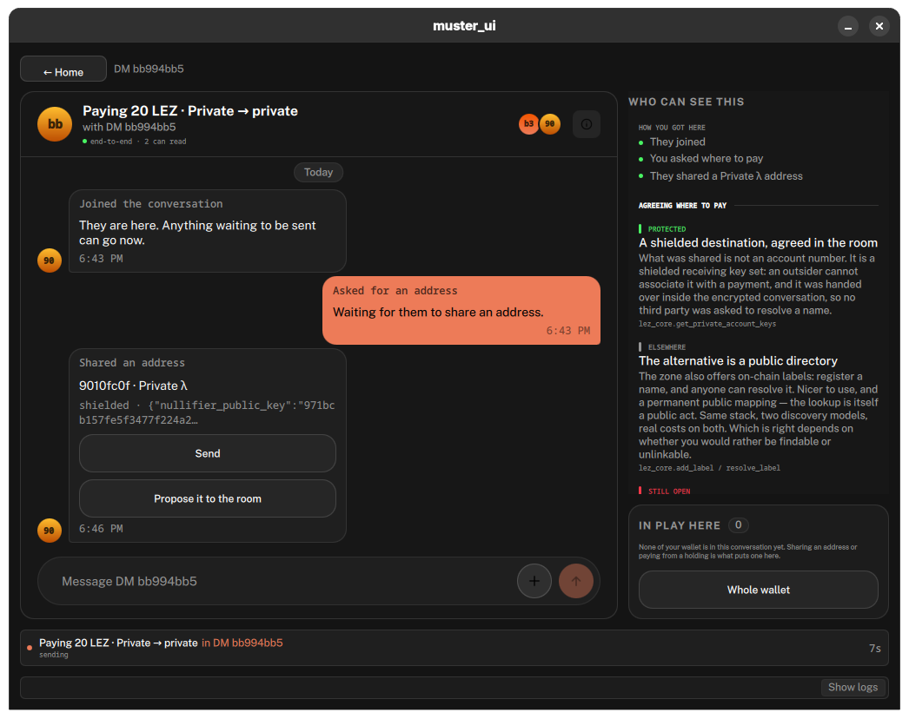
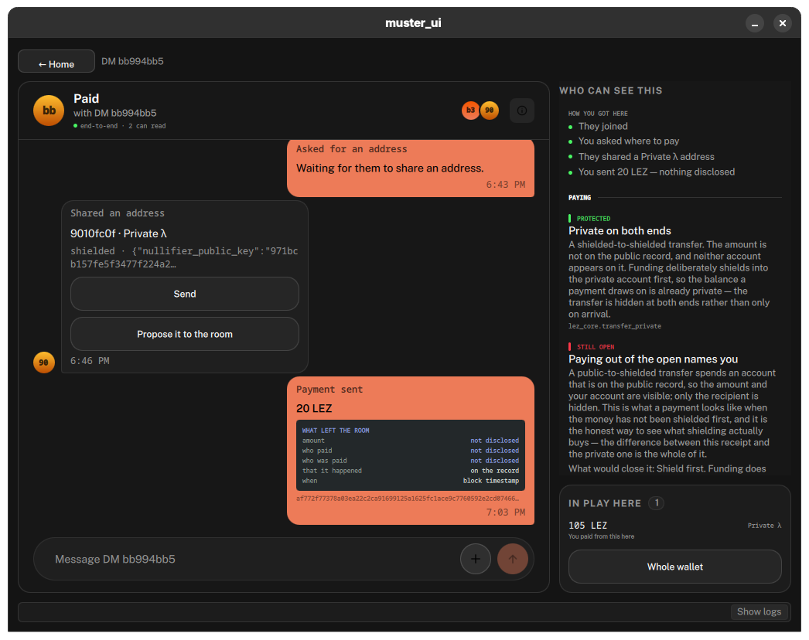

I've spent a good amount of time in "crypto," and I've always been displeased at the incompleteness of everyone's view around privacy and security. When my focus was security, I tried to convey that there's a lot of risk to be concerned about outside of smart contracts, but the industry only really talked or was concerned about them. There's rationality in that somewhat. The blockchain and smart contracts were new and needed tooling and new views at assessing risk within them needed to be developed. That's "where the money is" so to speak to so obvious there's a profitable market there. 

The same concept within privacy seems to be shaping up as it becomes a strong "meta" narrative across the ecosystem. It's always a focus on the blockchain itself and how operations occur above it. But it's so ridiculously incomplete if you take a step back and look at it. What hits the blockchain is actually the end of the entire lifecycle of a transaction. It's the record of so much other work and coordination and all of the steps before have potential to leak so much data that even a private blockchain doesn't actually help. 

This forum post is the start of a series of me investigating this concept, proving out and measuring what gets leaked across the entire txn lifecycle (of various activities) and what consequences that has to the user and the ecosystem at large. 

I've always wanted to do this but never was quite sure how. Fortunately, Logos is at a point where it's so much easier to do this than it's ever been for me. I and AI development drastically leverages how fast I can build things on my own within the Logos ecosystem and what is already out there I can bring in as a module. 

Breaking the txn lifecycle down into 7 stages, we have:
- discovery
- diligence
- negotiation
- contracting
- ordering
- settlement
- enforcement

I personally like thinking about it in a layer of abstraction above that, bucketing some of them together around differentiated activity: 
- coming together with an intended action - discover, diligence, negotiation
- contracting that action into some formality - contracting
- settling and executing that formal contract - ordering, settlement
- reacting to the results of that contract execution - enforcement

Saying it all into a few sentences that reads more smoothly would be: I come together with others with the intention to do something. We agree on what we're doing and create a contract of that agreement. We then register that contract and do the thing. We then we separate and live our lives based on the outcome of that execution. 

Even more succinctly: My friend wanted some SNT, so I sent them some. 

Now think about all the technology we use in order to make those things happen, and how much of that stuff the blockchain _isn't_. Think about who owns that infrastructure and why they own it and how they profit off owning it. Once you've done that for a bit, I think you'll start to realize why everyone who isn't in crypto hates crypto and why we're failing as an industry compared to the ideals we all started out with. Almost all of the failings of crypto happen before anything hits the blockchain. 

INSERT EXAMPLES HERE AND THEIR PLACE IN THE TXN LIFECYCLE

I could literally go on ad nauseum about this (I have for years now). So instead, I'm going to "build an app" (read: vibe code the living shit out of it based on spec-based development practices) to show it, and then write about it in this forum for others to see, challenge, add to, contribute. That app is called "Muster." Why? Because I've always liked the idea of an app that is focused on rallying people together for the purpose of action, so "mustering up" feels like a good way to describe that, and also "Status" is taken already. I also don't want another chat app, but it's crucial to understand that the chat context _can also be the inherited security and privacy context of coordation_.  [I've written about this concept before in the Status forums](https://discuss.status.app/t/what-is-status/4903) and also when "announcing the new Status App" [years ago at EthDenver](https://www.youtube.com/watch?v=5UGqTbqKH90). This is not a new concept for me. You can find the [code in Github](https://github.com/corpetty/muster) and look at all the pretty diagrams that I vibe code along the way at [it's hosted Pages](https://corpetty.github.io/muster). 

Please note, this app is created by me for a number of reasons, the main one being an educational and demonstrative tool to explore what's going on under the hood with our data and how well we can surface it to the user in a meaningful way. Along the way, I'm hoping it makes the decentralized application _I've always wanted_ and is useful to others in getting things done in "web3". Maybe it sucks and just surfaces bugs as I dogfood the Logos tech stack and see how far I can push it and look at its operation. Let's see.  

Why use Logos? Simple. Logos as a technology concept is an attempt to cater to and secure the entire txn lifecycle within the same ecosystem, thus mitigating as much of the issues I've experienced in the industry this whole time. Additionally, it's modular and provides a good development experience which is amenable to vibe coding and at a stage where I can meaningfully build stuff without being on the core dev team. I also am paid to understand things and explain them within Logos and outside of it, and this helps me do that. Also, this is currently built as a standalone application using the Logos stack, but will very soon be offered as a module within basecamp so that you can move more easily between interdependent applications. So [go download Basecamp](https://logos.co/basecamp) and get used to it. Right now, architecturally, it's built this way:

DIAGRAM OF MUSTER'S ARCHITECTURE

So come with me as we look at the first bucket of activity: Coming together with an intended action.

I'm going to demonstrate this with one of the simplest and most common actions in crypto, sending someone some tokens. In Muster, I'll do this via a private-to-private LEZ transfer, but the concepts described through this particular action's txn lifecycle can be extrapolated to all transactions even though details of the pipeline are different. 

Typically for most, this part of the txn lifecycle isn't even thought of as part of the pipeline at all, but in my opinion, it is a vital part of it. The process of finding all the parties involved with the activity you're doing, finding a common place to coordinate, and then negotiating what you're going to do to get into agreement is all of the intent of the transaction. Knowing a group's intent and ensuring it is explicitly agreed to is valuable, both for the parties involved as well as people who may want to profit off of (or censor) such intent happening. 

Because the industry has been so tunnel visioned on only the blockchain part of the pipeline, we've fostered a standard of use that leverages nothing but hosted platforms that feeds off your data for this part, and rarely if at all is the infrastructure being used remotely connected to the rest of the pipeline. What is beautiful about the Logos vision is that it's all the same infrastructure, so you never need to use different applications across the entire process. Let's walk through this process within Muster's initial demo application. 

DIAGRAM OF PRIVATE TO PRIVATE TXN WITHIN LOGOS STACK

