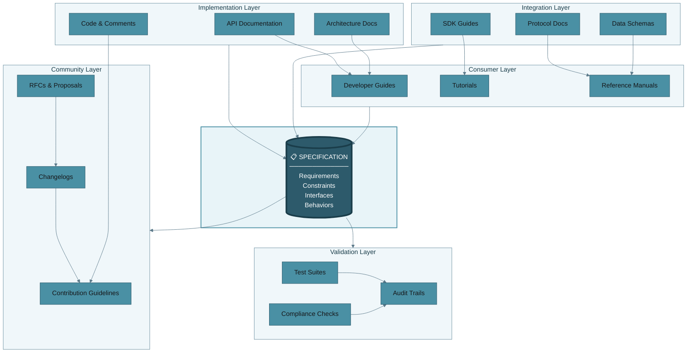

Below is a dependency graph if each type of technical documentation and how it relates to specifications. Each node in the graph is clickable, which then will lead you to a document explaining what it is, and how it depends upon specifications. 

