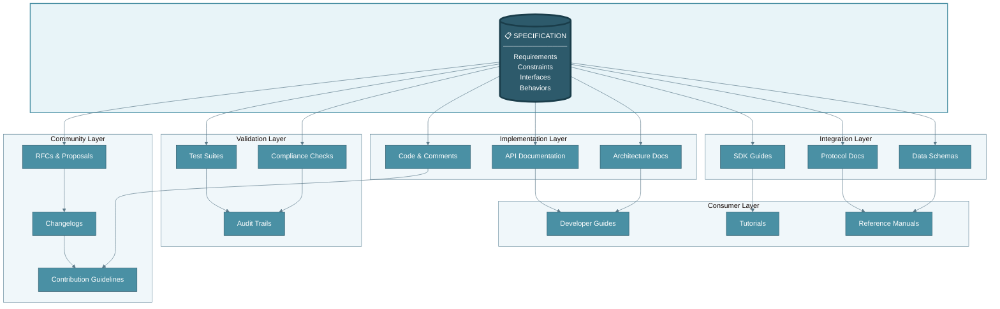

```mermaid
%%{init: {'theme': 'base', 'themeVariables': { 'primaryColor': '#4a90a4', 'primaryTextColor': '#fff', 'primaryBorderColor': '#2d5a6b', 'lineColor': '#5c7a8a', 'secondaryColor': '#6b8e9f', 'tertiaryColor': '#e8f4f8'}}}%%

flowchart TD
    subgraph foundation[" "]
        SPEC[("📋 SPECIFICATION<br/>─────────────<br/>Requirements<br/>Constraints<br/>Interfaces<br/>Behaviors")]
    end

    subgraph implementation["Implementation Layer"]
        API[API Documentation]
        ARCH[Architecture Docs]
        CODE[Code & Comments]
    end

    subgraph integration["Integration Layer"]
        SDK[SDK Guides]
        PROTO[Protocol Docs]
        SCHEMA[Data Schemas]
    end

    subgraph consumption["Consumer Layer"]
        DEV[Developer Guides]
        TUT[Tutorials]
        REF[Reference Manuals]
    end

    subgraph validation["Validation Layer"]
        TEST[Test Suites]
        COMPLY[Compliance Checks]
        AUDIT[Audit Trails]
    end

    subgraph community["Community Layer"]
        CONTRIB[Contribution Guidelines]
        RFC[RFCs & Proposals]
        CHANGE[Changelogs]
    end

    SPEC --> API
    SPEC --> ARCH
    SPEC --> CODE
    
    SPEC --> SDK
    SPEC --> PROTO
    SPEC --> SCHEMA
    
    API --> DEV
    ARCH --> DEV
    SDK --> TUT
    PROTO --> REF
    SCHEMA --> REF
    
    SPEC --> TEST
    SPEC --> COMPLY
    TEST --> AUDIT
    COMPLY --> AUDIT
    
    SPEC --> RFC
    RFC --> CHANGE
    CHANGE --> CONTRIB
    CODE --> CONTRIB

    style SPEC fill:#2d5a6b,stroke:#1a3d4a,stroke-width:4px,color:#fff
    style foundation fill:#e8f4f8,stroke:#4a90a4,stroke-width:2px
    style implementation fill:#f0f7fa,stroke:#6b8e9f
    style integration fill:#f0f7fa,stroke:#6b8e9f
    style consumption fill:#f0f7fa,stroke:#6b8e9f
    style validation fill:#f0f7fa,stroke:#6b8e9f
    style community fill:#f0f7fa,stroke:#6b8e9f
```

