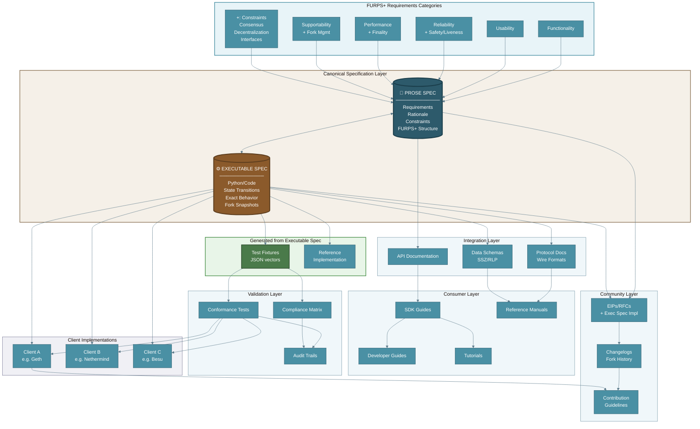

```mermaid
%%{init: {'theme': 'base', 'themeVariables': { 'primaryColor': '#4a90a4', 'primaryTextColor': '#fff', 'primaryBorderColor': '#2d5a6b', 'lineColor': '#5c7a8a', 'secondaryColor': '#6b8e9f', 'tertiaryColor': '#e8f4f8'}}}%%

flowchart TD
    subgraph furps["FURPS+ Requirements Categories"]
        F[Functionality]
        U[Usability]
        R[Reliability<br/>+ Safety/Liveness]
        P[Performance<br/>+ Finality]
        S[Supportability<br/>+ Fork Mgmt]
        PLUS["+": Constraints<br/>Consensus<br/>Decentralization<br/>Interfaces]
    end

    subgraph canonical["Canonical Specification Layer"]
        PROSE[("📄 PROSE SPEC<br/>─────────────<br/>Requirements<br/>Rationale<br/>Constraints<br/>FURPS+ Structure")]
        EXEC[("⚙️ EXECUTABLE SPEC<br/>─────────────<br/>Python/Code<br/>State Transitions<br/>Exact Behavior<br/>Fork Snapshots")]
    end

    subgraph generated["Generated from Executable Spec"]
        FIXTURES[Test Fixtures<br/>JSON vectors]
        REFIMPL[Reference<br/>Implementation]
    end

    subgraph implementations["Client Implementations"]
        CLIENT1[Client A<br/>e.g. Geth]
        CLIENT2[Client B<br/>e.g. Nethermind]
        CLIENT3[Client C<br/>e.g. Besu]
    end

    subgraph integration["Integration Layer"]
        API[API Documentation]
        PROTO[Protocol Docs<br/>Wire Formats]
        SCHEMA[Data Schemas<br/>SSZ/RLP]
    end

    subgraph consumer["Consumer Layer"]
        SDK[SDK Guides]
        DEV[Developer Guides]
        TUT[Tutorials]
        REF[Reference Manuals]
    end

    subgraph validation["Validation Layer"]
        TEST[Conformance Tests]
        COMPLY[Compliance Matrix]
        AUDIT[Audit Trails]
    end

    subgraph community["Community Layer"]
        EIP[EIPs/RFCs<br/>+ Exec Spec Impl]
        CONTRIB[Contribution<br/>Guidelines]
        CHANGE[Changelogs<br/>Fork History]
    end

    %% FURPS+ feeds into specifications
    F --> PROSE
    U --> PROSE
    R --> PROSE
    P --> PROSE
    S --> PROSE
    PLUS --> PROSE

    %% Prose and Executable spec relationship
    PROSE <--> EXEC

    %% Executable spec generates artifacts
    EXEC --> FIXTURES
    EXEC --> REFIMPL

    %% Clients derive from executable spec
    EXEC --> CLIENT1
    EXEC --> CLIENT2
    EXEC --> CLIENT3

    %% Test fixtures validate clients
    FIXTURES --> TEST
    TEST --> CLIENT1
    TEST --> CLIENT2
    TEST --> CLIENT3

    %% Specs feed integration layer
    PROSE --> API
    EXEC --> PROTO
    EXEC --> SCHEMA

    %% Integration feeds consumer layer
    API --> SDK
    PROTO --> REF
    SCHEMA --> REF
    SDK --> DEV
    SDK --> TUT

    %% Validation from specs and fixtures
    FIXTURES --> COMPLY
    TEST --> AUDIT
    COMPLY --> AUDIT

    %% Community layer
    PROSE --> EIP
    EXEC --> EIP
    EIP --> CHANGE
    CHANGE --> CONTRIB
    CLIENT1 --> CONTRIB

    style PROSE fill:#2d5a6b,stroke:#1a3d4a,stroke-width:3px,color:#fff
    style EXEC fill:#8b5a2b,stroke:#5c3d1e,stroke-width:3px,color:#fff
    style FIXTURES fill:#4a7a4a,stroke:#2d4a2d,stroke-width:2px,color:#fff
    style furps fill:#e8f4f8,stroke:#4a90a4,stroke-width:2px
    style canonical fill:#f5f0e8,stroke:#8b7355,stroke-width:2px
    style generated fill:#e8f5e8,stroke:#4a904a,stroke-width:2px
    style implementations fill:#f0f0f5,stroke:#6a6a8a
    style integration fill:#f0f7fa,stroke:#6b8e9f
    style consumer fill:#f0f7fa,stroke:#6b8e9f
    style validation fill:#f0f7fa,stroke:#6b8e9f
    style community fill:#f0f7fa,stroke:#6b8e9f
```
